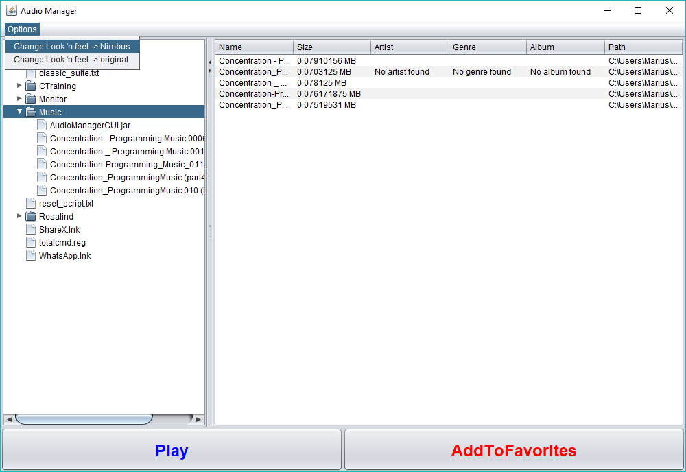

# Audio-Manager-GUI
Project made for learning purposes . Written in Java , using swing library.

### Things to be mentioned :

### Button for adding to favorites was implemented to save the name of a certain selected .mp3 file in a directory (which is hardcoded).
###### However , saving only it's name (as an empty file) , and not copying the data stream you cannot play the file . (But the exception was treated).
### The search function shouldn't take very long , however I have not tested it on a very `crowded` directory.

Sample :

 
